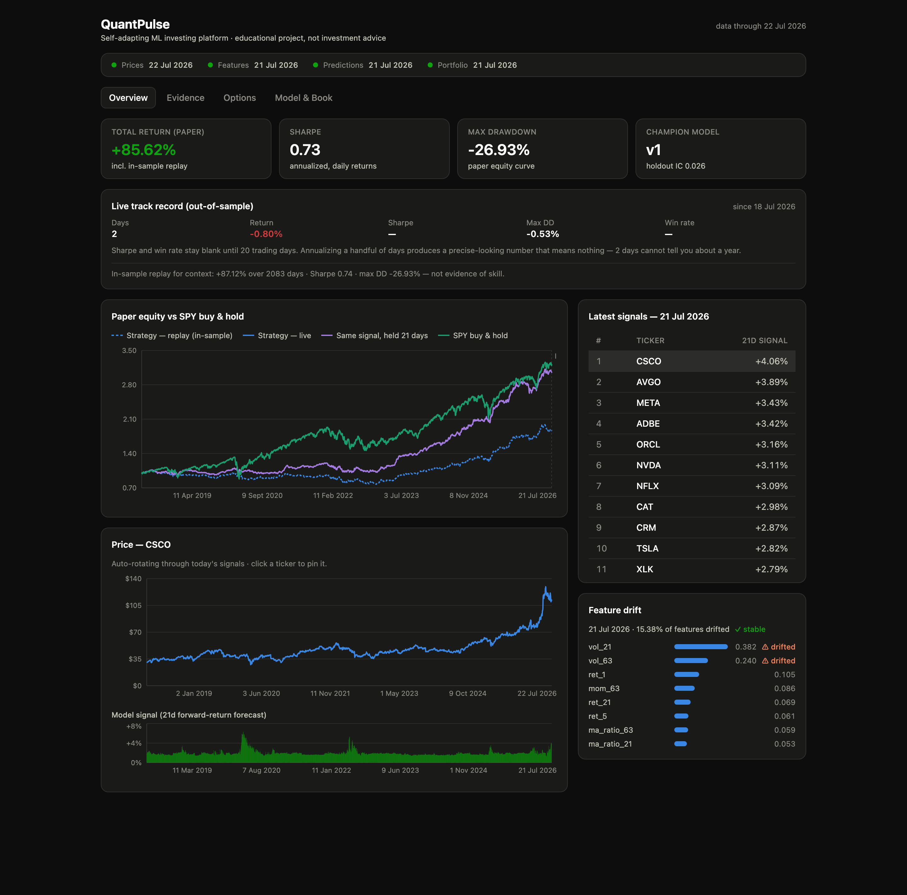
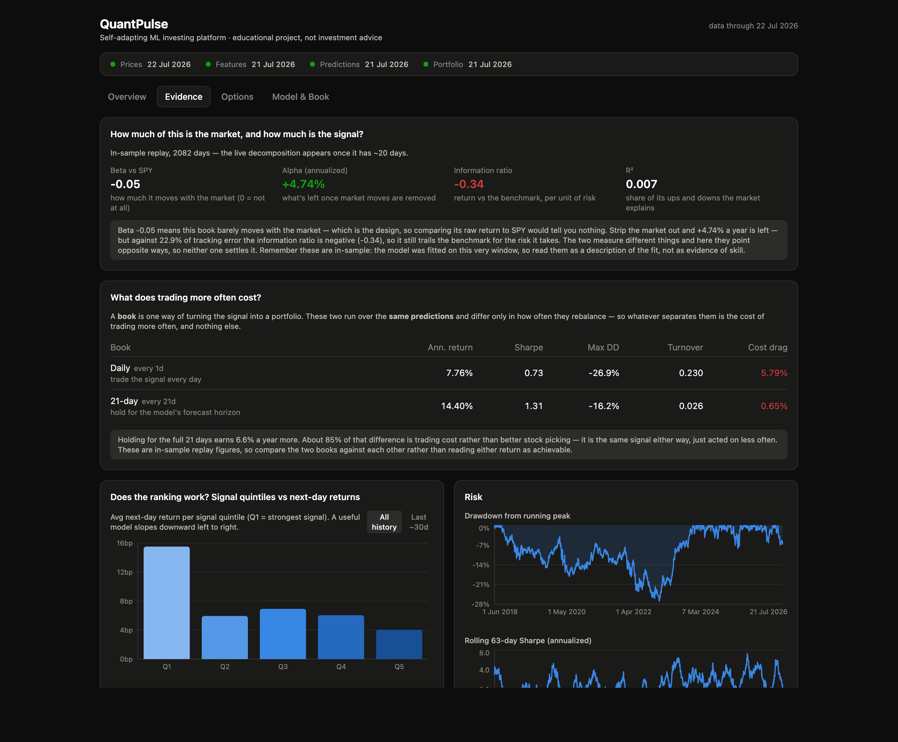
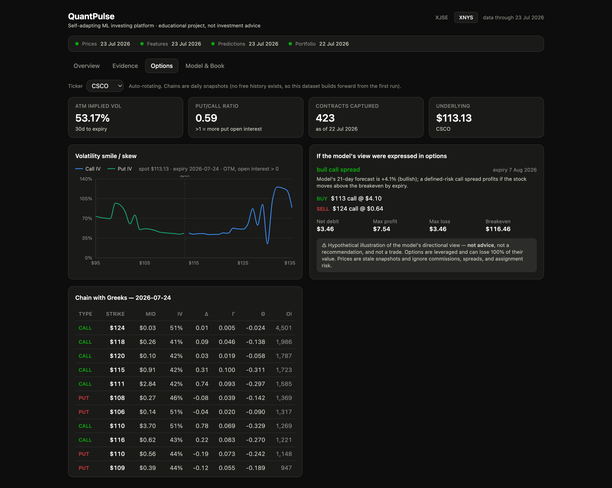
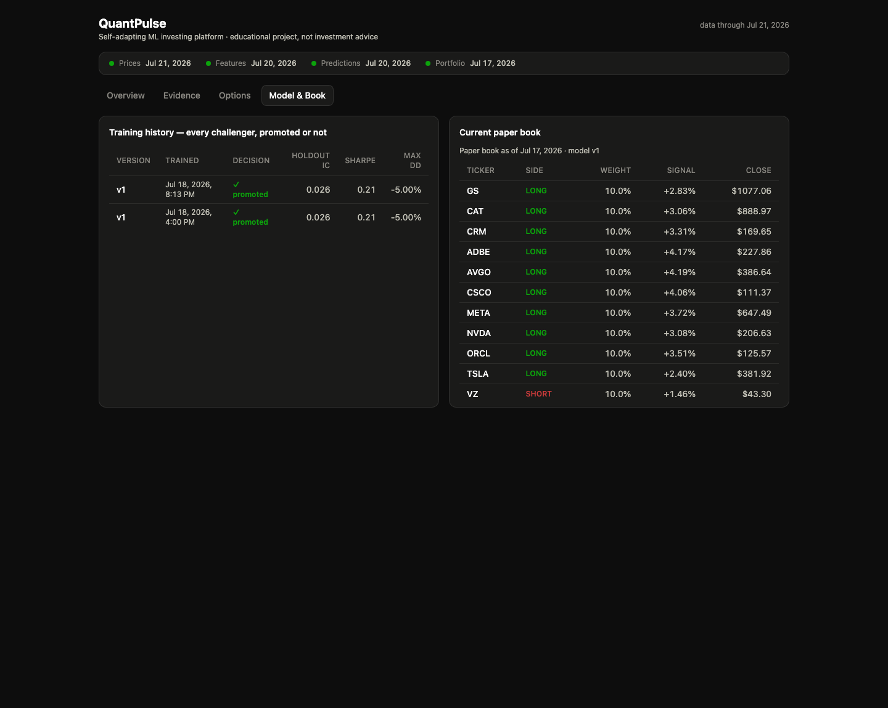
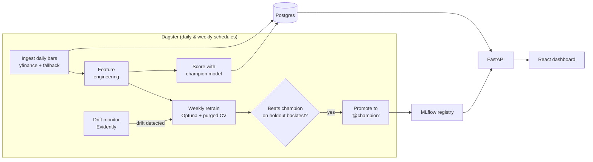

# QuantPulse

[](https://github.com/enkay-pixel/quantpulse/actions/workflows/ci.yml)
[](LICENSE)
[](pyproject.toml)
[](web/package.json)

A local-first MLOps platform for a **self-adapting ML investing model**. Fully free, fully open-source, runs on one machine via Docker: automated data pipelines, scheduled retraining with champion/challenger promotion, drift monitoring, a serving API, and a live dashboard.

> **Disclaimer**: educational engineering project. Nothing here is investment advice, and the model's signals are research output in a sandbox — not trade recommendations.



<details>
<summary><b>More screenshots</b> — Evidence, Options, and Model &amp; Book tabs</summary>

### Evidence — does the model actually have skill?



The CAPM decomposition is the headline: **beta −0.05 and R² 0.006 confirm the book is
genuinely market-neutral**, so comparing its raw return to SPY was never the right test.
What matters is alpha — currently **−0.56% annualized**, i.e. the signal adds nothing
independent of the market over this window. Below it, signal quintiles still slope the
right way (Q1 highest → Q5 lowest: real ranking skill, modest in size) alongside drawdown
and rolling Sharpe.

### Options — implied volatility, Greeks, and a hypothetical expression of the signal



The volatility smile is built from **out-of-the-money contracts with open interest only** —
deep in-the-money options barely trade, so their quoted IV is stale noise that would
otherwise spike both wings past 150%. The right-hand card translates the model's
directional view into a defined-risk spread, clearly labelled as illustration, never advice.

### Model &amp; Book — every champion/challenger decision, and the current paper positions



</details>

## What it does



- **Ingestion** — daily OHLCV bars for a configurable US stock + ETF universe ([configs/universe.yaml](configs/universe.yaml)), with retries, rate-limit respect, and data-quality checks as Dagster asset checks.
- **Self-adapting model** — LightGBM forward-return model retrained weekly *and* whenever feature drift is detected; a challenger only replaces the champion if it wins on an out-of-sample backtest.
- **Transforms** — a dbt project ([transform/](transform/)) builds staging views and analytics marts (daily returns, signal-quintile performance, portfolio drawdown) with dbt tests, integrated into the Dagster asset graph via `dagster-dbt`.
- **Options analytics** — daily live option-chain snapshots (free via yfinance) enriched with Black-Scholes Greeks, surfaced as an implied-volatility smile/skew, put/call ratio, and a chain browser. Because no free *historical* chain data exists, the pipeline **builds its own options history forward** from the first run. A clearly-disclaimered panel also illustrates how the model's directional view *would* translate into a defined-risk spread — an illustration, never advice.
- **Measured honestly** — a CAPM decomposition separates market exposure (beta) from genuine skill (alpha) and reports the information ratio, because raw return vs SPY is a meaningless test for a market-neutral book. The dashboard states the verdict in plain English so the numbers can't be misread.
- **Fails loudly, catches up by itself** — a run-failure sensor logs every failure (served at `/alerts`, plus a desktop notification) and a catch-up sensor re-requests any trading day the schedule slept through, so a laptop that sleeps doesn't silently cost you irreplaceable history.
- **Honest cost modelling** — the backtest charges commission, slippage, and an annualized short-borrow fee, and `quantpulse sensitivity` sweeps both to report a *range* of outcomes plus the breakeven trading cost, rather than a single flattering number.
- **Evidence, not vibes** — the dashboard separates the in-sample replay from the **live out-of-sample track record**, benchmarks the strategy against SPY buy-and-hold, charts signal-quintile forward returns and rolling risk, and shows every champion/challenger decision the self-adapting loop ever made.
- **Serving** — FastAPI exposes predictions, portfolio equity curve, model metadata, and drift status.
- **Dashboard** — React app with templated charts that refresh from the API.

## Quickstart

```bash
cp .env.example .env          # adjust if you like
make up                       # start the Docker stack
make install                  # install package + dev tools into your venv
make test                     # run unit tests
```

### First run (seed the platform)

On a fresh database, one command migrates the schema, syncs the universe, backfills
history, computes features, trains + promotes the first champion, and scores the
signal trail for the dashboard:

```bash
make bootstrap
```

From then on the Dagster schedules keep everything current whenever the stack is up
(weekday ingest/scoring after the close, weekly retraining, drift-triggered retraining).
The dashboard's pre-champion equity history is an **in-sample replay** to seed the
charts — the live track record accrues from the first scheduled runs onward.

| UI | URL |
|---|---|
| Dagster | http://localhost:3000 |
| MLflow | http://localhost:5001 (5000 is taken by macOS AirPlay) |
| API docs | http://localhost:8000/docs |
| Dashboard | http://localhost:8080 |

Postgres is exposed on `localhost:5432` (DBeaver-friendly; credentials in your `.env`).

## Project status

- [x] M0 — Project scaffold, tooling, CI
- [x] M1 — Data platform (schema, ingestion, quality checks)
- [x] M2 — ML core (features, purged CV, training, backtest, promotion)
- [x] M3 — Dagster orchestration + full Docker stack
- [x] M4 — Serving API
- [x] M5 — React dashboard
- [x] M6 — Docs polish & first release
- [x] M7 — dbt transform layer (staging + marts, tests in CI, dagster-dbt lineage)
- [x] M8 — Evidence dashboard (live vs replay track record, SPY benchmark, quintile & risk charts, model audit trail)
- [x] M9 — Options layer (chain snapshots + Greeks, IV surface & put/call marts, Options tab, hypothetical signal→spread translation)
- [x] M10 — Rigor & reliability (CAPM alpha/beta, failure alerts, missed-day catch-up)

## Development

```bash
make fmt        # format + autofix
make lint       # CI-style checks
make type       # mypy
make test-all   # includes integration tests (needs `make up`)
make hooks      # install pre-commit hooks
```

Current state, honest performance, and what's next: [docs/roadmap.md](docs/roadmap.md).
Design decisions are recorded in [docs/adr/](docs/adr/). Architecture details in [docs/architecture.md](docs/architecture.md); operational how-tos in [docs/runbook.md](docs/runbook.md); the full build narrative and incident log in [docs/development-history.md](docs/development-history.md).

## License

MIT
