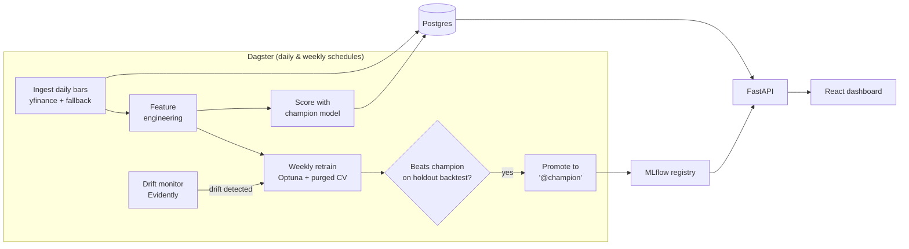

# QuantPulse

A local-first MLOps platform for a **self-adapting ML investing model**. Fully free, fully open-source, runs on one machine via Docker: automated data pipelines, scheduled retraining with champion/challenger promotion, drift monitoring, a serving API, and a live dashboard.

> **Disclaimer**: educational engineering project. Nothing here is investment advice, and the model's signals are research output in a sandbox — not trade recommendations.

## What it does



- **Ingestion** — daily OHLCV bars for a configurable US stock + ETF universe ([configs/universe.yaml](configs/universe.yaml)), with retries, rate-limit respect, and data-quality checks as Dagster asset checks.
- **Self-adapting model** — LightGBM forward-return model retrained weekly *and* whenever feature drift is detected; a challenger only replaces the champion if it wins on an out-of-sample backtest.
- **Serving** — FastAPI exposes predictions, portfolio equity curve, model metadata, and drift status.
- **Dashboard** — React app with templated charts that refresh from the API.

## Quickstart

```bash
cp .env.example .env          # adjust if you like
make up                       # start the Docker stack
make install                  # install package + dev tools into your venv
make test                     # run unit tests
```

| UI | URL |
|---|---|
| Dagster | http://localhost:3000 |
| MLflow | http://localhost:5001 (5000 is taken by macOS AirPlay) |
| API docs | http://localhost:8000/docs |
| Dashboard | http://localhost:8080 |

Postgres is exposed on `localhost:5432` (DBeaver-friendly; credentials in your `.env`).

## Project status

- [x] M0 — Project scaffold, tooling, CI
- [x] M1 — Data platform (schema, ingestion, quality checks)
- [x] M2 — ML core (features, purged CV, training, backtest, promotion)
- [x] M3 — Dagster orchestration + full Docker stack
- [x] M4 — Serving API
- [ ] M5 — React dashboard
- [ ] M6 — Docs polish & first release

## Development

```bash
make fmt        # format + autofix
make lint       # CI-style checks
make type       # mypy
make test-all   # includes integration tests (needs `make up`)
make hooks      # install pre-commit hooks
```

Design decisions are recorded in [docs/adr/](docs/adr/). Architecture details in [docs/architecture.md](docs/architecture.md); operational how-tos in [docs/runbook.md](docs/runbook.md).

## License

MIT
